# How to replace the cable on Sony MDR-W08 headphones

1, Order the following cable:

http://www.lunashops.com/goods.php?id=3625

These only cost $4 when shipped, but do take a long time to arrive.

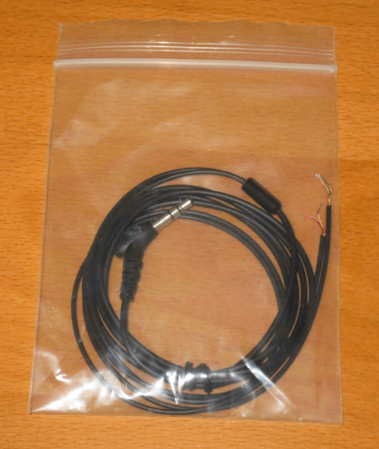

2, Using a small watchmaker's screwdriver, remove the plastic insets

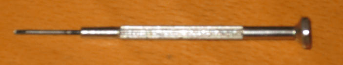

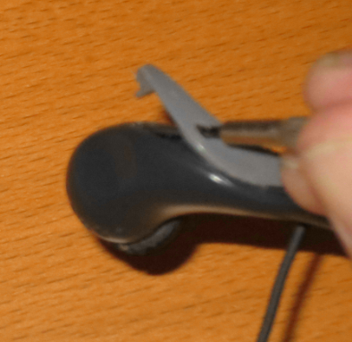

3, Use the screwdriver to lever out the little speakers.

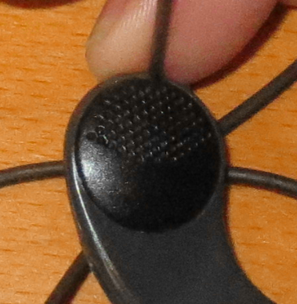

This is a bit tricky and I could not always achieve this without causing a little cosmetic damage

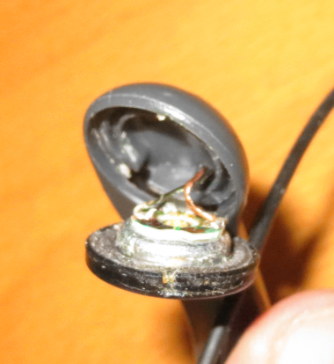

4, Cut the cable on both sides of the knots and remove the old cable

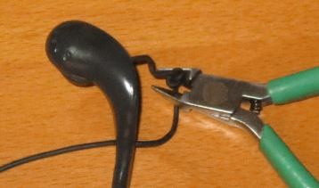

5, Thread the new cable through the outer hole, place a knot in it about 4 inches from the end, and then thread it through the inner hole. The pair with a reddish wire is for the right ear, and the pair with greenish wire is for the left ear.

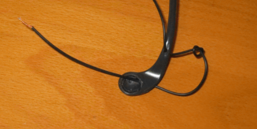

6, Tape the speakers to something and using a soldering iron remove the old cable ends and attach the new ones.

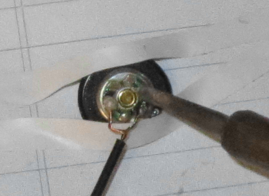

7, Put the speakers back into the headset (and note the little notch that must match up).

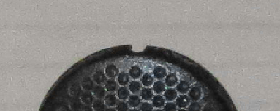

This is also good time to test to seee if they work.

One of the headphones I repaired had a dead speaker so I canablized one I had in these ear clip type

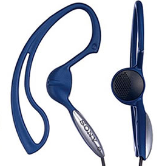

(I was not 100% sure they were the same, but they sound fine to me.)

8, Move the knot so only a small amount of slack cable will be inside.

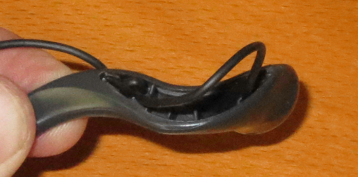

9, Replace the inserts and enjoy your headphones.
